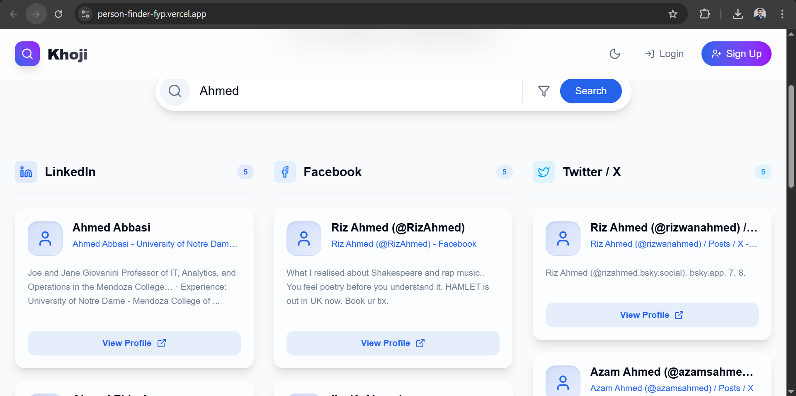
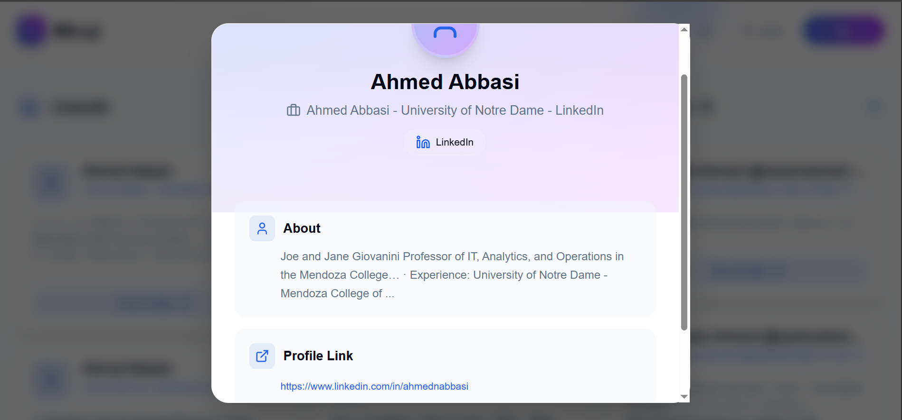
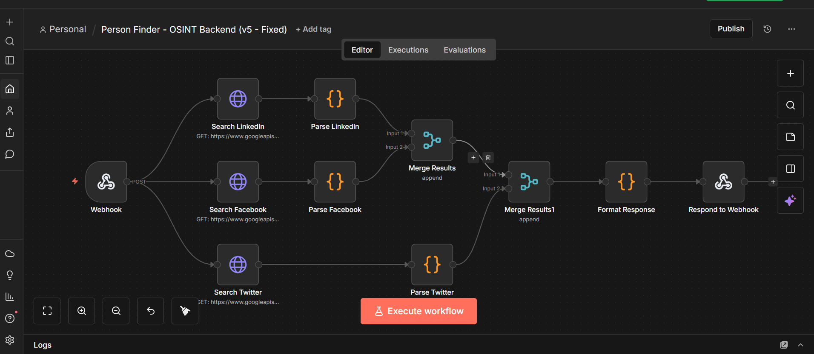

# Khoji — OSINT People Search 🔍

**Khoji** is an advanced OSINT (Open Source Intelligence) web application that finds people across **LinkedIn**, **Facebook**, and **Twitter/X** using a single search query. It aggregates public profile data and presents results in a clean, unified interface.

## ✨ Features

- **Multi-Platform Search** — Simultaneously searches LinkedIn, Facebook, and Twitter
- **Smart Filtering** — Filter results by name, location, university, and company
- **Detailed Profile Views** — Click any result for a rich detail modal with direct profile links
- **User Authentication** — Sign up / login with session persistence
- **Dark & Light Mode** — System-aware theme toggle with smooth transitions
- **Responsive Design** — Fully optimized for desktop and mobile
- **Beautiful UI** — Glassmorphism design, animated blobs, Framer Motion transitions

## � Screenshots

### Search & Results Application


### Detailed Profile View


## �🛠️ Tech Stack

| Layer | Technology |
|-------|-----------|
| **Frontend** | React 19, Vite 7 |
| **Styling** | Tailwind CSS 4, Framer Motion |
| **Icons** | Lucide React |
| **Backend** | N8N Workflow Automation |
| **Search API** | Google Custom Search (via N8N) |

## 📦 Getting Started

### Prerequisites

- Node.js 18+
- npm

### Installation

```bash
git clone https://github.com/Wajid160/PersonFinder-FYP.git
cd PersonFinder-FYP
npm install
```

### Configuration

Create a `.env` file in the project root (optional — falls back to the default endpoint):

```env
VITE_N8N_WEBHOOK_URL=https://your-n8n-instance.com/webhook/person-finder
```

### Run Development Server

```bash
npm run dev
# Opens at http://localhost:5173
```

### Build for Production

```bash
npm run build
```

## 🏗️ Project Structure

```
src/
├── components/
│   ├── Auth/           # Login & Signup modals
│   ├── Results/        # ResultCard & PersonDetailModal
│   ├── Search/         # SearchBar with advanced filters
│   └── UI/             # LoadingOverlay with step animation
├── context/
│   └── AuthContext.jsx  # Authentication state management
├── services/
│   └── api.js           # N8N webhook integration & data transform
├── App.jsx              # Root component
├── index.css            # Tailwind + design tokens (light/dark)
└── main.jsx             # Entry point
docs/
├── n8n-workflow.json    # Importable N8N workflow file
├── n8n-workflow.png     # Visual workflow diagram
└── ...                  # Project screenshots
```

## ⚙️ Backend (N8N)

The search backend is powered by an N8N workflow that orchestrates Google Custom Search API requests.

### Workflow Logic
1. Receives the search query via webhook
2. Runs optimized Google searches for each platform (`site:linkedin.com/in`, `site:facebook.com`, `site:twitter.com`)
3. Parses and structures the results
4. Returns categorized JSON: `{ linkedin: [...], facebook: [...], twitter: [...] }`



### Setup Your Own Backend
1. Create an N8N instance (self-hosted or cloud)
2. Import the workflow file: [docs/n8n-workflow.json](docs/n8n-workflow.json)
3. Set up **Google Custom Search API** credentials in N8N
4. Configure the Google Search nodes with your `CX` (Search Engine ID) and API key credential
5. Set the webhook URL in your frontend `.env` file

## 📄 License

MIT — Built by **Wajid Javed**
